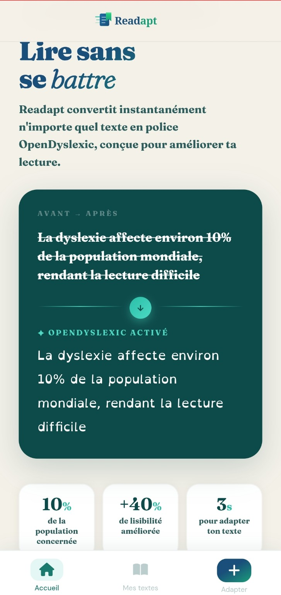
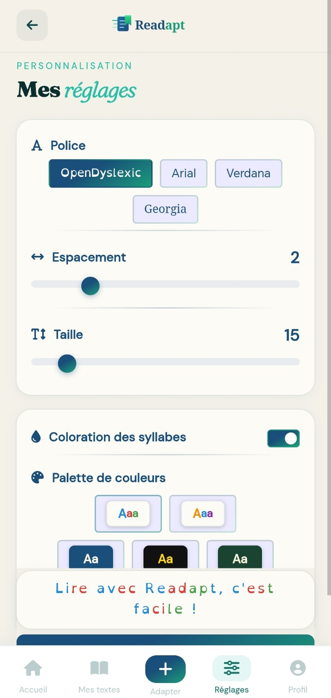

# Readapt

[](https://github.com/TonyLawrence85/readapt/actions/workflows/ci.yml)

**AI-powered reading assistant designed to make written content more accessible for people with dyslexia.**

Readapt is a full-stack accessibility application that transforms text, PDFs and photographed content into a personalized reading experience using artificial intelligence, accessible typography, syllable support, text-to-speech and synchronized reading.

<p align="center">
  
</p>

## Why Readapt

Written information is not equally accessible to every reader. Readapt explores how AI and conventional accessibility tools can work together without replacing user choice: content can be restructured for readability, while typography, spacing, syllable support and audio remain configurable.

Users can paste text, upload a PDF, or photograph printed content. Readapt extracts and processes the content, applies an AI accessibility transformation, and presents the result using the user's preferred reading settings.

<table>
<tr>
<td align="center"><strong>Paste text</strong></td>
<td align="center"><strong>Take a photo</strong></td>
</tr>
<tr>
<td></td>
<td></td>
</tr>
</table>

## Core Features

- AI-powered text adaptation with meaning-preservation constraints
- Text, PDF and multimodal image input
- OpenDyslexic and alternative reading fonts
- Configurable typography, spacing and visual palettes
- Optional syllable-based reading support
- Text-to-speech generation
- Audio/text synchronization using transcription timestamps
- Saved content, favourites and personal reading library
- Devise authentication with user-scoped article authorization
- Background audio processing with Active Job

## AI-powered adaptation

Readapt uses a Large Language Model to restructure complex written content while preserving its meaning. The transformation strategy favors shorter sentences, clearer structure and controlled vocabulary simplification while preserving names, dates, numbers, quotations and important technical information.

The adapted content can then be displayed with accessible typography and optional syllable-based visual support.

<p align="center">
  
</p>

## Read and listen at the same time

Readapt combines text-to-speech with speech transcription and timing information to provide synchronized assisted reading. During playback, the relevant passage can be visually highlighted so users can follow the text while listening.

<p align="center">
  
</p>

## Personalized accessibility

Reading preferences are configurable rather than imposed. Users can adjust typography, text size, spacing, syllable coloration and visual palettes to create a reading environment that works for them.

<p align="center">
  
</p>

## Readapt Ecosystem

Readapt consists of two complementary products:

- **Readapt Web** — this Rails application provides AI-powered text adaptation, PDF and image processing, text-to-speech and synchronized assisted reading.
- **Readapt Chrome Extension** — adapts typography and reading layout directly on websites, with configurable fonts, spacing and a reading ruler.

[Explore the Readapt Chrome Extension repository](https://github.com/TonyLawrence85/readapt-chrome-extension)

## Processing Pipeline

```text
Text / PDF / Image
        |
        v
Content extraction
        |
        v
AI accessibility transformation
        |
        v
Reading formatting
        |
        +------------------+
        |                  |
        v                  v
Accessible text      Text-to-Speech
                           |
                           v
                    Audio transcription
                           |
                           v
                    Timestamp mapping
                           |
                           v
                 Synchronized reading
```

## Tech Stack

| Area | Technologies |
| --- | --- |
| Backend | Ruby, Ruby on Rails 8, PostgreSQL, Active Record |
| Frontend | Hotwire, Turbo, Stimulus, JavaScript, Bootstrap 5, SCSS |
| Authentication | Devise |
| AI | OpenAI API, RubyLLM, multimodal GPT models, Whisper |
| Audio | Google Cloud Text-to-Speech, OpenAI Whisper |
| Files | Active Storage, PDF Reader, Cloudinary, Image Processing |
| Background jobs | Active Job, Solid Queue |
| Infrastructure | Docker, Kamal, Puma |
| Quality & security | GitHub Actions, Minitest, RuboCop, Brakeman, Bundler Audit, Dependabot |

## Architecture

Readapt follows Rails MVC with service objects for domain and external-service logic and background jobs for longer-running media processing.

```text
app/
├── controllers/       # HTTP flows and authorization boundaries
├── models/            # persistence and domain relationships
├── services/          # AI adaptation, formatting and TTS
├── jobs/              # asynchronous audio pipeline
├── views/             # server-rendered UI
├── javascript/        # Stimulus controllers
└── assets/
```

A typical reading workflow is:

```text
Article creation
      |
      v
ArticleAdaptationService
      |
      v
Adapted content persisted
      |
      v
AudioGenerationJob
      |
      +--> Text-to-Speech
      +--> Active Storage attachment
      +--> Whisper transcription
      +--> Timestamp generation
      |
      v
Synchronized reading experience
```

## AI Safety and Prompt Strategy

The transformation layer uses accessibility-oriented constraints rather than unrestricted generation. The prompt strategy favors short sentences and predictable formatting while instructing the model to preserve factual information and avoid inventing content.

External AI and audio services are isolated behind application boundaries so core behavior can be tested without making network calls.

## Testing, Security and CI

Readapt has an automated GitHub Actions pipeline on pushes and pull requests to `master`. The pipeline runs the Rails test suite and a separate quality/security job. fileciteturn111file0L2-L2

The current automated suite contains **21 tests** covering key application behavior, including:

- model validations and user defaults
- AI adaptation behavior with mocked external calls
- audio generation and timestamp processing with mocked TTS/transcription
- authentication requirements
- article ownership and cross-user access protection
- favourites and deletion
- authenticated article creation and background-job enqueueing

Security and quality checks include:

```bash
bin/rails test
bundle exec rubocop app lib Gemfile Rakefile
bundle exec brakeman --no-pager
bundle exec bundler-audit check --update
```

Article lookup in protected controller actions is scoped through the authenticated user's association, preventing another signed-in user from retrieving an article simply by knowing its ID.

## Local Installation

### Requirements

- Ruby
- Rails
- PostgreSQL
- OpenAI API key
- Google Cloud Text-to-Speech credentials

```bash
git clone https://github.com/TonyLawrence85/readapt.git
cd readapt
bundle install
bin/rails db:create
bin/rails db:migrate
bin/dev
```

Configure the required environment variables, including `OPENAI_API_KEY`. Additional credentials may be required for Google Cloud Text-to-Speech and Cloudinary.

## Deployment

The repository includes Docker configuration, Kamal deployment tooling, Puma and production-oriented Rails infrastructure for containerized deployment.

## Engineering Challenges

**Preserving meaning while improving readability.** The AI must restructure content without summarizing away essential information or inventing new details. This requires constrained prompt engineering and predictable output handling.

**Coordinating multiple AI and media services.** Readapt combines multimodal content understanding, text generation, text-to-speech and speech transcription within a Rails application while keeping those external dependencies testable.

**Audio/text synchronization.** Generated audio is transcribed and timing information is mapped back to adapted passages to support synchronized reading.

**Protecting user-owned content.** Authenticated article operations are scoped to the current user, and automated integration tests verify that one account cannot view, delete or modify another account's articles.

## What This Project Demonstrates

Readapt demonstrates full-stack Ruby on Rails development, relational data modeling, authentication and authorization, background jobs, file uploads, service-object design, AI API integration, multimodal AI, prompt engineering, speech-to-text, text-to-speech, external-service mocking, automated testing, CI, security scanning and accessibility-focused product design.

## Roadmap

- improved word-level audio synchronization
- additional accessibility profiles
- multilingual support
- OCR improvements
- AI-generated reading exercises
- reading progress analytics
- educator and parent dashboards
- API access

## Project Status

Readapt is under active development. It began as a full-stack development project and is evolving into a broader accessibility product spanning a Rails web application and a Chrome extension.

## Author

**Tony Lawrence**  
Full-Stack & AI Software Developer

Focus areas: Ruby on Rails, AI-powered web applications, OpenAI API integration, workflow automation and digital marketing.

[GitHub profile](https://github.com/TonyLawrence85)

## License

This project is currently intended for portfolio and demonstration purposes. All rights reserved unless otherwise stated.
